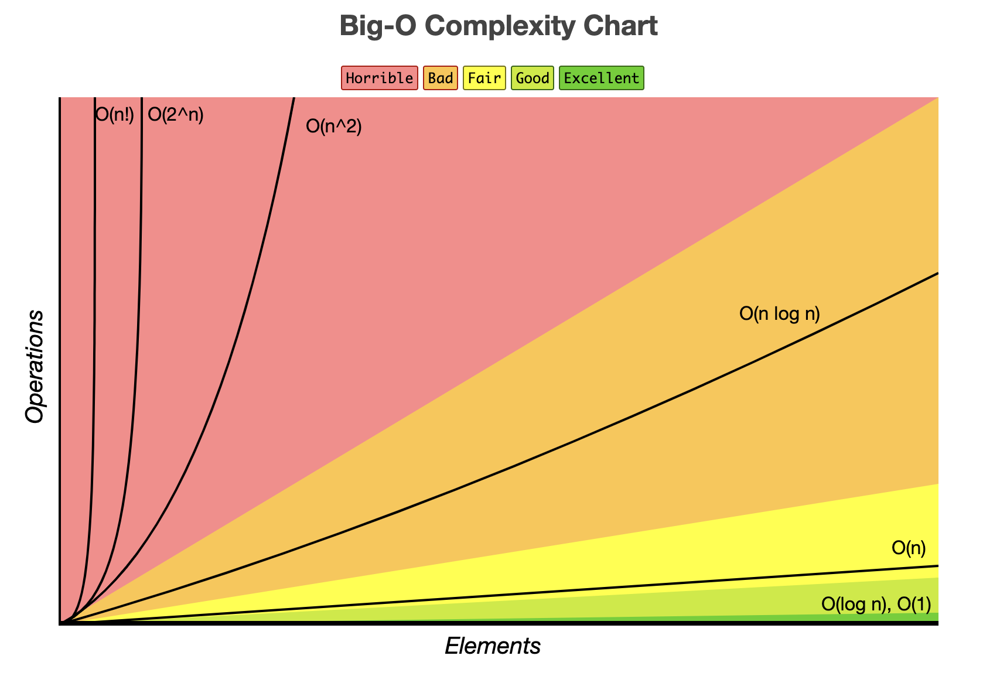

# Big O Notation

## Table of Contents
- [What Is Better Code?](#what-is-better-code)
- [What is Big O?](#what-is-big-o)
- [Big O Complexity Chart](#big-o-complexity-chart)
- [Time Complexity](#time-complexity)
  - [The Problem with Time](#the-problem-with-time)
  - [Counting Operations Instead of Measuring Time](#counting-operations-instead-of-measuring-time)
    - [Example TC-1](#example-tc-1)
    - [Example TC-2 (static for loop)](#example-tc-2-static-for-loop)
    - [Example TC-3 (multiple for loops)](#example-tc-3-multiple-for-loops)
    - [Example TC-4 (nested for loops)](#example-tc-4-nested-for-loops)
  - [Rules of Thumb (time complexity)](#rules-of-thumb-time-complexity)
- [Space Complexity](#space-complexity)
  - [Rules of Thumb (space complexity)](#rules-of-thumb-space-complexity)
  - [Example SC-1](#example-sc-1)
  - [Example SC-2](#example-sc-2)
- [Logarithms](#logarithms)
- [Analyzing the Performance of Objects and Arrays](#analyzing-the-performance-of-objects-and-arrays)
  - [Objects](#objects)
    - [Big O of Objects](#big-o-of-objects)
    - [Big O of Object Methods](#big-o-of-object-methods)
  - [Arrays](#arrays)
    - [Big O of Arrays](#big-o-of-objects)
    - [Big O of Array Methods](#big-o-of-array-methods)
- [Reference](#reference)

## What Is Better Code?
- **Faster?**
- **Less memory-intensive?**
- More readable?
  - Faster and less memory-intensive often come at the expense of readableness.
- Brevity?
  - Minimizing number of characters used.
- **Aim: write efficient code that does not use a lot of memory but is also readable.**

## What is Big O?
> Big O notation, also called Laundau's symbol, is a symbolism used in complexity theory, computer sciences, and mathematics to describe the asymptotic behavior of functions. Basically, it tells you how fast a function grows or declines.
- *Big O notation can give us a high level understanding of the time or space complexity of an algorithm.*
- *Big O notation is not about precision. It's about general trends (linear? quadratic? constant?).*
- *The time or space complexity (as measured by Big O) depends only on the algorithm, not the hardware used to run the algorithm.*
- An algorithm is O(f(n)) if the number of simple operations that the computer has to do is eventually less than a constant times f(n), as n increases.
  - **f(n) could be constant (f(n) = 1).**
    - As n grows, the runtime stays constant.
    - Has the least complexity.
    - O(1).
  - **f(n) could be linear (f(n) = n).**
    - As n grows, the runtime scales proportionate to n.
    - Ex: if n doubles, runtime doubles.
    - O(n).
  - **f(n) could be quadratic (f(n) = n^2).**
    - As n grows, the runtime scales proportionate to n^2.
    - Ex: if n doubles, runtime quadruples.
    - O(n^2).
  - **f(n) could be something entirely different.**
- How complex the algorithm is with respect to the input size.
  - **i.e. how the runtime of an algorithm grows as the input grows.**

## Big O Complexity Chart


---

## Time Complexity
- In computer science, the time complexity is **the computational complexity that describes the amount of computer time it takes to run an algorithm as the size of the input increases.**
- `performance.now()` Method
  - Number of ms since the document was created (opened the page).
  - Example
    ```js
    let t1 = performance.now();
    functionTest();
    let t2 = performance.now();
    console.log(`${(t2 - t1) / 1000} seconds.`)
    ```
### The Problem with Time
- Different machines will record different times, hence not reliable.
- The same machine will record different times.
- For fast algorithms, speed measurements may not be precise enough.
### Counting Operations Instead of Measuring Time
- Count the **number of simple operations** that the computer has to perform, instead of trying to count the exact seconds that it takes for a code to run.
- Generalize, regardless of the exact number.
#### Example TC-1
```js
// Approach 1
function sumFromOneTo(n) {
    let sum = 0;
    for (let i = 1; i <= n; i++) {
        sum += i;
    }
    return sum;
}

// Approach 2
function sumFromOneTo(n) {
    return (n * (n + 1)) / 2;
}
```
- Approach 1 (for loop)
  - Line 1: 1 assignment (`=`).
  - Line 2: 1 assignment (`=`), n comparisons (`<=`), n additions and n assignments (`++`).
  - Line 3: n additions and n assignments (`+=`).
  - As n grows, the number of operations and the time it takes, roughly grow in proportion to it.
    - Therefore, O(n).
- Approach 2
  - 3 simple operations (`*`, `+`, `/`).
  - As n grows, the number of operations and the time it takes, roughly stay constant.
    - Therefore, O(1).
#### Example TC-2 (static for loop)
```js
function logAtMost5(n) {
  for (let i = 0; i <= Math.min(5, n); i++) {
    console.log(i);
  }
}
```
- As n grows, it stays static at 5 iterations.
  - Therefore, O(1).
#### Example TC-3 (multiple for loops)
```js
function countUpAndDown(n) {
  console.log("Going up!");
  for (let i = 0; i < n; i++) {
    console.log(i);
  }
  console.log("At the top! Goind back down!");
  for (let j = n -1; j >= 0; j--) {
    console.log(j);
  }
  console.log("Back down!");
}
```
- For loops are O(n).
  - Therefore, O(n).
#### Example TC-4 (nested for loops)
```js
function printAllPairs(n) {
  for (let i = 0; i < n; i++) {
    for (let j = 0; j < n; j++) {
      console.log(i, j);
    }
  }
}
```
- O(n) inside O(n).
  - Therefore, O(n^2).
### Rules of Thumb (time complexity)
**1. Arithmetic operations are constant.**  
**2. Variable assignment is constant.**  
**3. Accessing elements in an array (by index) or object (by key) is constant.**  
**4. In a loop, the complexity is the length of the loop times the complexity of whatever happened inside of the loop.**

---

## Space Complexity
- The space complexity of an algorithm or a computer program is the amount of memory space required to solve an instance of the computational problem as a function of characteristics of the input. It is the memory required by an algorithm until it executes completely.
- The space that an algorithm takes up as the size of the input increases.
- Big O notation can also be used to analyze space complexity.
### Rules of Thumb (space complexity)
**1. Most primitives (booleans, numbers, undefined, null) are constant space.**  
**2. Strings require O(n) space (where n is the string length).**  
**3. Reference types are generally O(n), where n is the length (for arrays) or the number of keys (for objects).**
### Example SC-1 
```js
function sum(arr) {
  let total = 0;
  for (let i = 0; i < arr.length; i++) {
    total += arr[i];
  }
  return total;
}
```
- 1 number.
- 1 number.
- *`total+= arr[i]` is not new space because the variables have already been allocated space.*
  - Therefore, O(1).
### Example SC-2
```js
function double(arr) {
  let newArr = [];
  for (let i = 0; i < arr.length; i++) {
    newArr.push(2 * arr[i]);
  }
  return newArr;
}
```
- If `arr` has length of n, `newArr` will be length of n.
  - Space that's being taken up is directly proportionate to n.
  - Therefore, O(n).

## Logarithms
- Inverse of exponentiation.
### Rule of Thumb
- The binary logarithm of a number roughly measures the number of times you can divide that number by 2 before you get a value that's less than or equal to one.
- log === log2
  - log === log base 2.
  - Use shorthand because it is the general trend that we care about.
### Occasions
- Certain searching algorithms have logarithmic time complexity.
- Efficient sorting algorithms involve logarithms.
- Recursion sometimes involves logarithmic space complexity.

## Analyzing the Performance of Objects and Arrays
### Objects
- Objects are really quick for pretty much everything. However, there is no order.
#### Big O of Objects
- Insertion - O(1).
- Removal - O(1).
- Searching - O(n).
- Access - O(1).
#### Big O of Object Methods
- Object.keys - O(n)
  - As the object grows, so does the number of operations and the amount of time it takes to compile those.
- Object.values - O(n).
- Object.entries - O(n).
- hasOwnProperty - O(1).
### Arrays
- Arrays have an intrinsic ordering to their data.
#### Big O of Arrays
- Insertion - depends
  - Inserting at the end of an array - O(1).
  - Inserting at the beginning of an array - O(n).
    - Because every single elements need to be reindexed.
- Removal - depends
  - Removing at the end of an array - O(1).
  - Removing at the beginning of an array - O(n).
- Searching - O(n).
- Access - O(1).
#### Big O of Array Methods
- Push - O(1).
- Pop - O(1).
- Shift - O(n).
- Unshift - O(n).
- Concat - O(n).
- Slice - O(n).
- Splice - O(n).
- Sort - O(n * log(n)).
  - The time it takes to sort an array takes larger than O(n) because we have to make a lot of comparisons and move things around.
- forEach/map/filter/reduce/etc. - O(n).
  - Because we're doing something with each element.

## Reference
[Big O notation.doc](https://web.mit.edu/16.070/www/lecture/big_o.pdf)  
[Big-O Algorithm Complexity Cheat Sheet](https://www.bigocheatsheet.com/)
