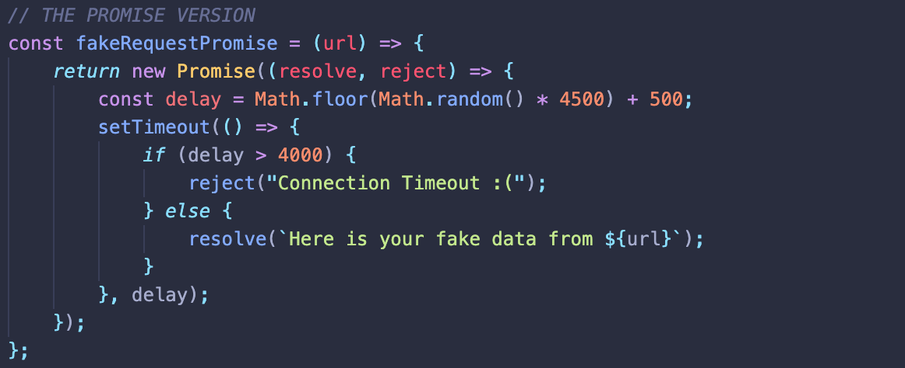

# Asynchronous JS

## Table of Contents
- [Prerequisites](#prerequisites)
  - [Singled Threaded and Synchronous](#single-threaded-and-synchronous)
  - [Call Stack](#call-stack)
- [Working Around Synchronous JS](#working-around-synchronous-js)
  - [Web APIs](#web-apis)
- [Dealing with Asynchronous Data](#dealing-with-asynchronous-data)
  - [Callbacks](#callbacks)
  - [Promises](#promises)
  - [Async Functions](#async-functions)
- [Reference](#reference)

## Prerequisites

### Single Threaded and Synchronous
- JS is **always** single threaded and synchronous.
- Single Threaded
  - At any given point in time, a single JS thread is running.
  - i.e., only one thing happens at a time in the JS script.
- Synchronous
  - Everything is executed one by one.
  - i.e., if one task takes 5s, the following code will have to wait their turn for 5s.
  - Ex: HTTP request.
    - Nothing happens until the response gets back (blocking, a.k.a. beach ball).

### Call Stack
- The JS Engine creates a **stack** data structure where function execution contexts are placed when the function is called or invoked.
- Mechanism that the JS interpreter uses to keep track of its place in a script and what's being executed.
- **Stack**
  - LIFO/FILO data structure.
- Basic Flow
  - Script calls a function, which is added to the call stack.
  - Any other functions that are then called by that function are added to the call stack further up, and run where their calls are reached.
  - When the current function is finished, it is taken off the stack and resumes execution wher it left off in the last code listing.

## Working Around Synchronous JS
For example, when making requests to servers, it can take some time to get the data but we don't want our program/website to stall and wait for the data to come back. We want to keep executing our script.  
As we don't know how long it will take to do something with a server, we need our code to wait until the `response` is returned before it tries to do anything else to it.

*JS is only asynchronous in that it can hand off certain tasks to the browser, AJAX, etc. to handle while it synchronously runs through the script.*

### Web APIs
- **`setTimeout()`**
  - Sets a timer which executes a function or specified code once the timer expires.
  - Telling the browser: "when the timer ends, push the callback function to the callback queue."
  - Flow:
    - JS runs through script (synchronously).
    - When JS encounters a Web API function, it is passed on to the browser (asynchronous bit).
      - "Hey browser, please remind me to put this code back into my call stack after 3s."
    - In the meantime, JS continues to run through the script (synchronously).
    - Browser finishes the given task (placing and checking a timer).
      - "Hey JS, 3s are over. I'm leaving this code in the callback queue for you to take and put in your callstack asap."
    - The callback is returned to the stack and JS continues to run through the script (synchronously).
- **`setInterval()`**
  - Repeatedly calls a function or specified code with a fixed time interval between each call.
- **`clearInterval()`**
  - Cancels interval set by `setInterval`.
  - Syntax: `clearInterval(IntervalID)`
- More on APIs [here](../Web-APIs.md)

## Dealing with Asynchronous Data

### Callbacks

#### Definition
A function that is passed as an argument to another function, which will invoke the argument(callback) at a given time to complete some kind of routine or action.

#### Example

- A function for async operations usually requires two or more callbacks (one for success, one for failure) as its arguments.


- Using callbacks can result to a lot of nesting (callback hell).
- Flow:
```
asyncOpFunction (url1, 
  successFunction () {
    // for req1;
    asyncOpFunction (url2,  
      successFunction () {
        // for req2;
        asyncOpFunction (url3,
          successFunction () {
            // for req3;
          },
          failFunction () {
            // for req3;
          }
        );
      },
      failFunction () {
        // for req2;
      }
    );
  },
  failFunction () {
    // for req1;
  }
);
```

### Promises

#### Definition
A Promise is an **object** representing **the eventual resolution of success or failure of an asynchronous operation**.  
It is a returned object to which callbacks are attached, instead of passed in to the function.  
These callbacks will run depending on whether the promise was resolved or rejected.

#### Description
- 3 States
  - pending: initial state where the promise is neither fulfilled nor rejected.
  - fulfilled: the async operation was successfully resolved.
  - rejected: the async operation failed.
- Promise Methods
  - **`.then()`**
    - Attach a callback by writing code to run if the promise is resolved in the `()`.
    - **Returns a promise, hence can be chained on.**
      - Ex: if this promise was resolved, check this promise.
  - **`.catch()`**
    - Attach a callback by writing code to run if the promise is rejected in the `()`.
    - Returns a promise.

#### Creating Promises


#### Working with Promises
##### Syntactical Flow

##### Cleaner Version

- Can avoid nesting multiple initial functions by returning it inside **`.then()`**, *which returns a promise*, with corresponding argument.
- **`.catch()`** can be reduced to one for all.

### Async Functions
A function that is declared with the **`async`** keyword, and permits the **`await`** keyword to be used in it.  
The two keywords enable asynchronous, promise-based behavior to be written in a cleaner style (don't have to explicitly configure promise chains).

#### Keywords
- **`async`**
  - Dealing with promises/response but in a more elegant way.
- **`await`**
  - Used to wait for a `Promise`.
  - It will pause the execution of the function, waiting for a `Promise` to be resolved before continuing on.
- **`return`**
  - If the function `return`s a value, the `Promise` will be resolved with that value.
- **`throw`**
  - If the function `throw`s an exception/error, the promise will be rejected.
- **`try...catch`** Statement
  - Handle rejection in async functions using `try...catch` statement.
  - Execute codes in `try {}`, and when an exception is thrown, execute codes in `catch {}`.
  - When an error is caught, the remaining codes are not executed. So, we could include code in `catch {}` that we want to execute despite error.

#### Note
- Returning a value inside a `setTimeout()` doesn't return a `Promise` that could be `await`ed.
- Therefore, it needs to be wrapped with a `Promise` for it to work as intended.

#### Example 

- Created an async function in which the previously created `Promise` will be called.
- "Wait for this request to return. If it is resolved/returned, store it in a variable."


### AJAX/AJAJ

#### Definition
Asynchronous JavaScript And XML (AJAX).

## Reference
[Asynchronous JavaScript | MDN](https://developer.mozilla.org/en-US/docs/Learn/JavaScript/Asynchronous)
