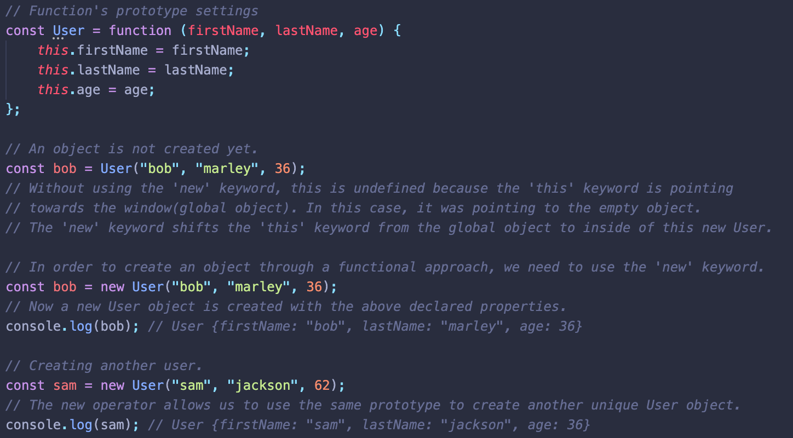
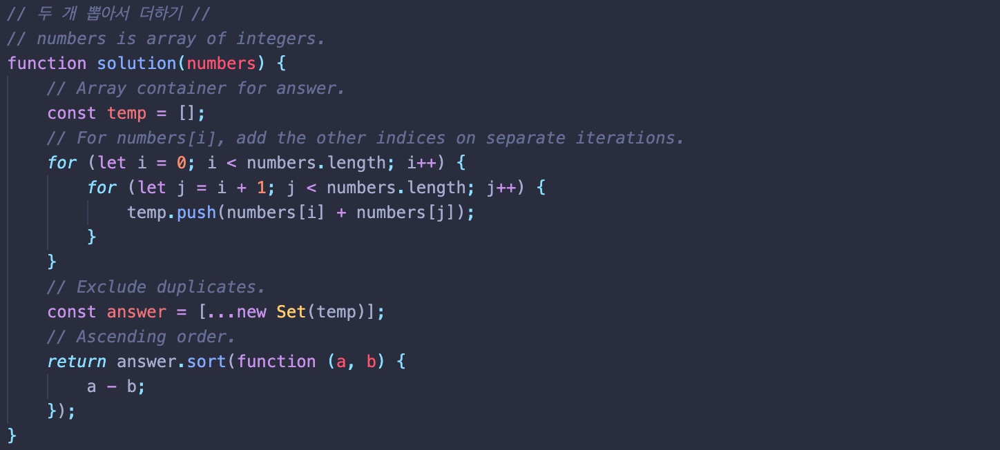
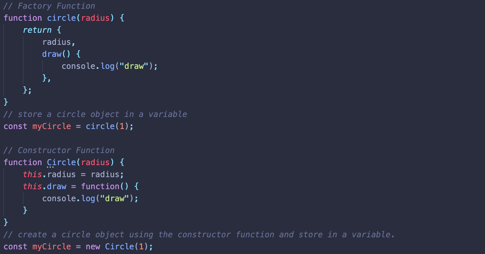

# Operators and Keywords

## Clarifications

### Class vs. Object

#### Class
- A blueprint that defines all of the methods, properties that objects can have. But doesn’t actually give any data or information.
- A holder for what the object is going to look like.

#### Object
- An instantiated version of a class.
- Basically, a specific version of the class that has all the extra information filled in.

#### `new` Keyword
- How we actually take a class and turn it into an object.
- To do that, we use the constructor inside of the class.

### Constructor
- A function that creates an instance of an object.
- Purpose is to create an object and set values if there are any object properties present.
- A constructor gets called when you declare an object using the ‘new’ keyword.

## `this` Keyword
- Refers to the object that is executing the current function.
  - In a method (a function that is part of an object)
    - `this` refers to the object itself.
  - In a regular function (not part of an object)
    - `this` refers to the global object (window in browsers; global in node).

## `new` Keyword
- Creates an instance of a user-defined object type or of one of the built-in object types that has a constructor function.
- 3 Effects
  1. Create an empty object.
    - Invokes the constructor and creates a unique instance of the object every single time.
  2. Sets `this` keyword to point to that new object.
    - As soon as the `new` keyword is used, it is not a regular function call anymore, for which `this` points to global object.
  3. Returns that object from the constructor function without having to use `return` keyword.

### Example

## Set() Constructor
- Allows us to create collections of unique values. 
- A value in the Set may only occur once! No Duplicates!
- `Set()` requires ‘new’ operator.
- new Set(array) is an object per se. So need to use spread (…).

### Example

## Factory Functions vs. Constructor Functions
- Common Objective: construct or create a JS object.
- Naming Convention
  - Factory Function - camel notation
  - Constructor Function - pascal notation
- Approach in Creating Objects
  - Factory Function - use ‘return’ keyword in the function to return an object.
  - Constructor Function - use the ‘new’ operator and the ‘this’ keyword instead of returning an object inside the function. 

### Example

## Reference
[What are Classes, Objects, and Constructors?](https://www.youtube.com/watch?v=5AWRivBk0Gw&ab_channel=WebDevSimplified)  
[JavaScript this Keyword](https://www.youtube.com/watch?v=gvicrj31JOM)
