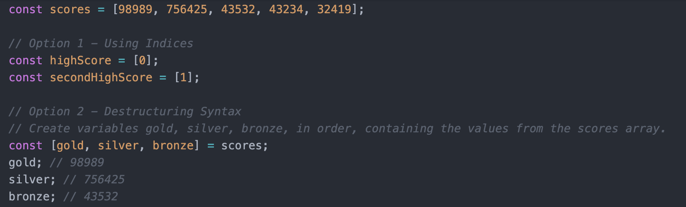
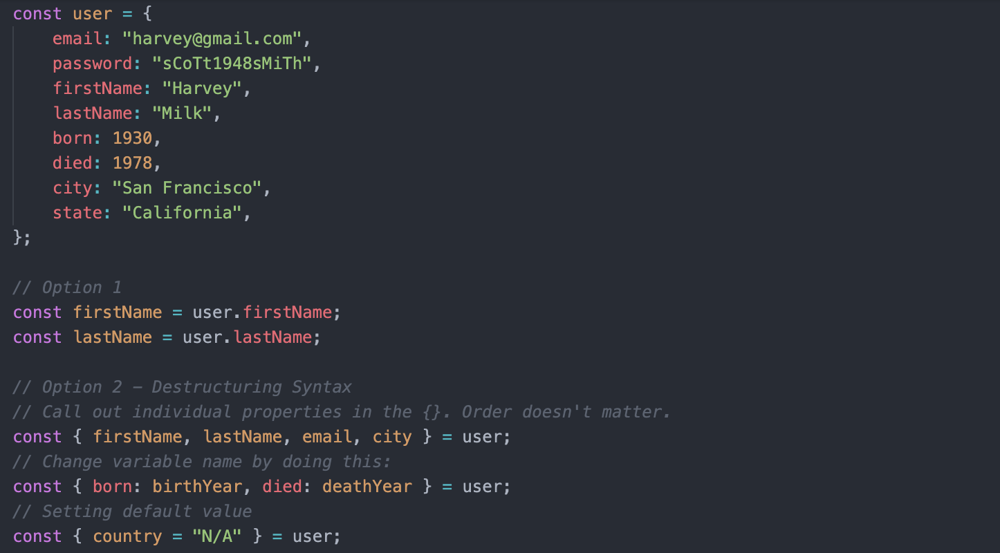
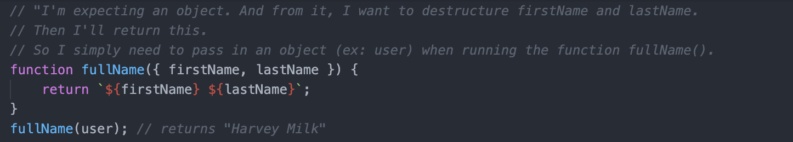
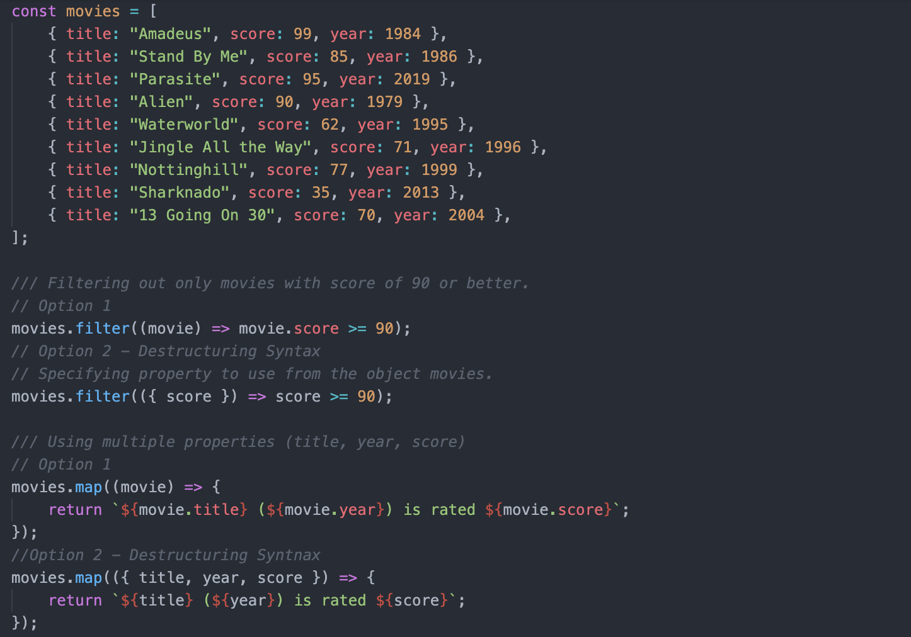

# Destructuring Assignment

## Table of Contents
- [Destructuring](#destructuring)
- [Destructuring Arrays](#destructuring-arrays)
- [Destructuring Objects](#destructuring-objects)
- [Destructuring Parameters](#destructuring-parameters)

## Destructuring
> Javascript expression that makes it possible to unpack values from arrays, or properties from objects, into distinct variables.
- A way to unpack, extract, single out:
  - Values from arrays
  - Properties from objects
- Into distinct variables without altering the original array or object.

## Destructuring Arrays
### Syntax
```
const [a, b, ...rest] = [10, 20, 30, 40, 50]
// OR
let a, b, rest;
[a, b, ...rest] = [10, 20, 30, 40, 50];

console.log(a); // 10
console.log(b); // 20
console.log(rest); // [30, 40, 50]
```
### Example


## Destructuring Objects
### Syntax
```
const {a, b, ...rest} = {a: 10, b: 20, c: 30, d: 40});
// OR
let a, b, rest;
({a, b, ...rest} = {a: 10, b: 20, c: 30, d: 40});

console.log(a); // 10
console.log(b); // 20
console.log(rest); // {c: 30, d: 40}
```
### Example


## Destructuring Parameters
- When defining a function, we can destructure the values that are being passed in.
### Example 1

- The function expects an object. And from the object, it will destructure the particular properties.
### Example 2


## Reference
[Destructuring assignment - JavaScript | MDN](https://developer.mozilla.org/en-US/docs/Web/JavaScript/Reference/Operators/Destructuring_assignment)
