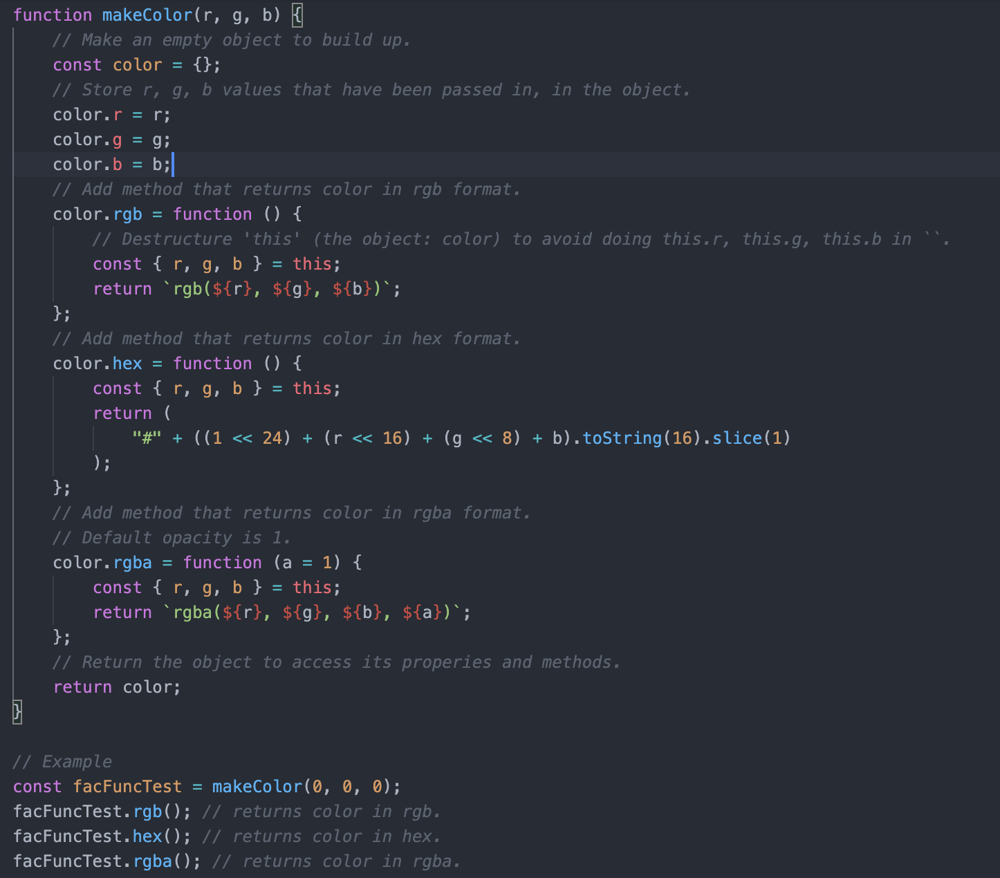

# Factory Function
- Make a prototype object to which we can add properties and methods based off of arguments that have been provided, and then return that object.
- One way of making objects based off of a pattern/recipe (not ideal).

## Example

