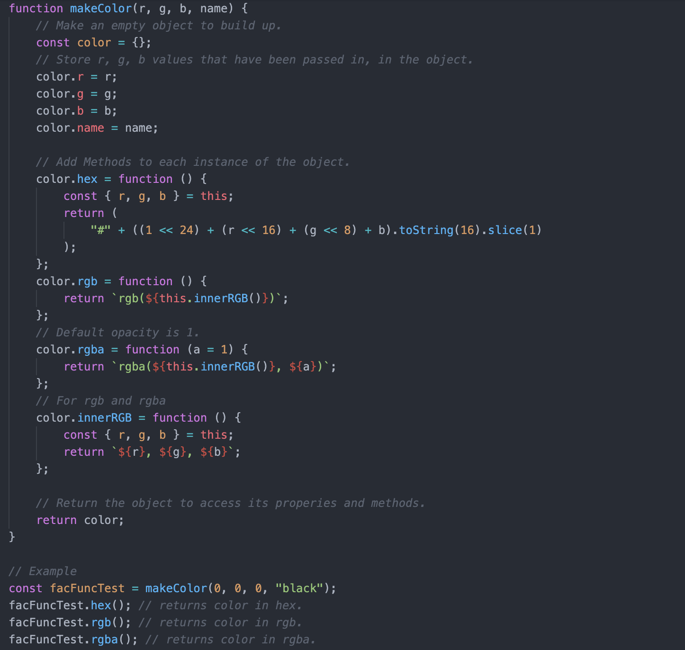
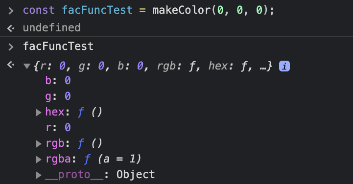
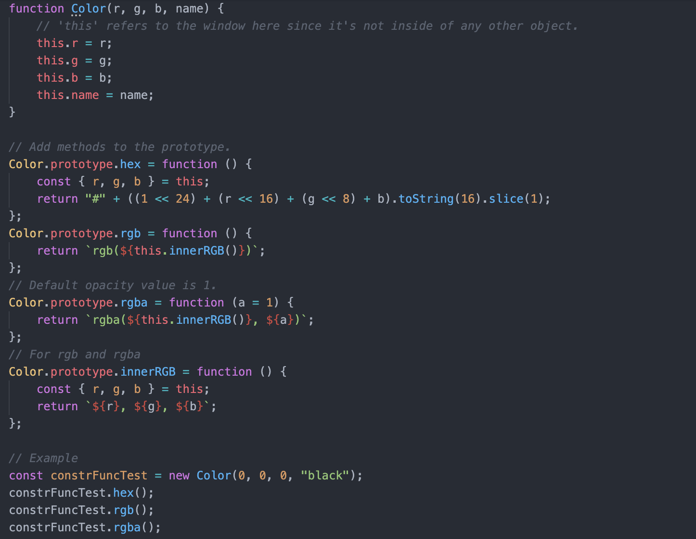
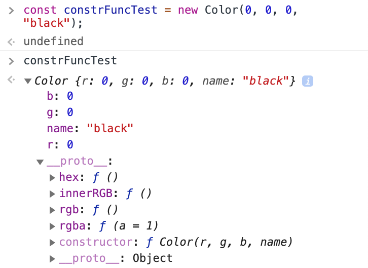
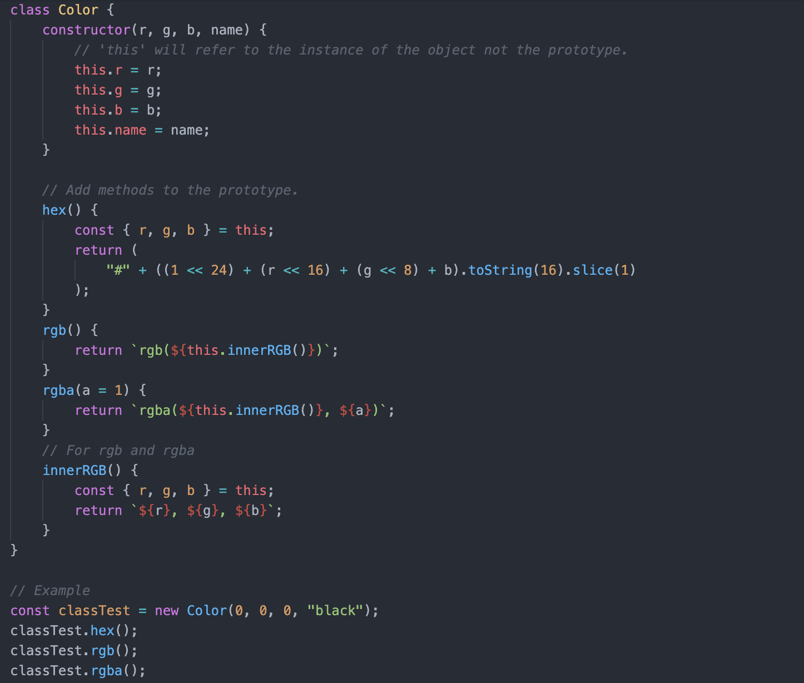
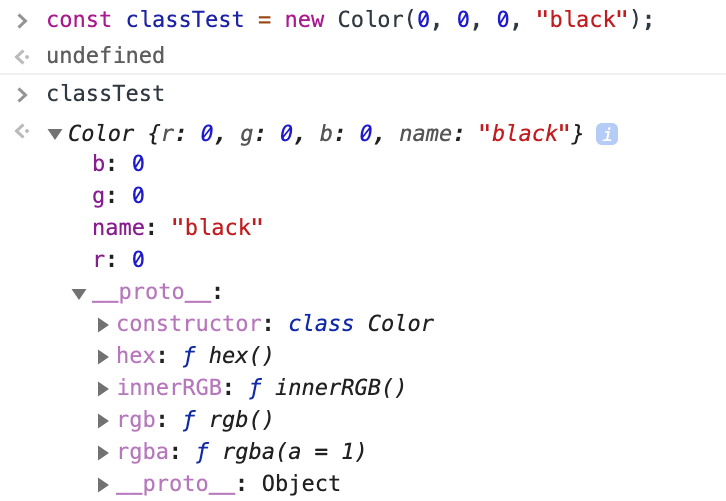
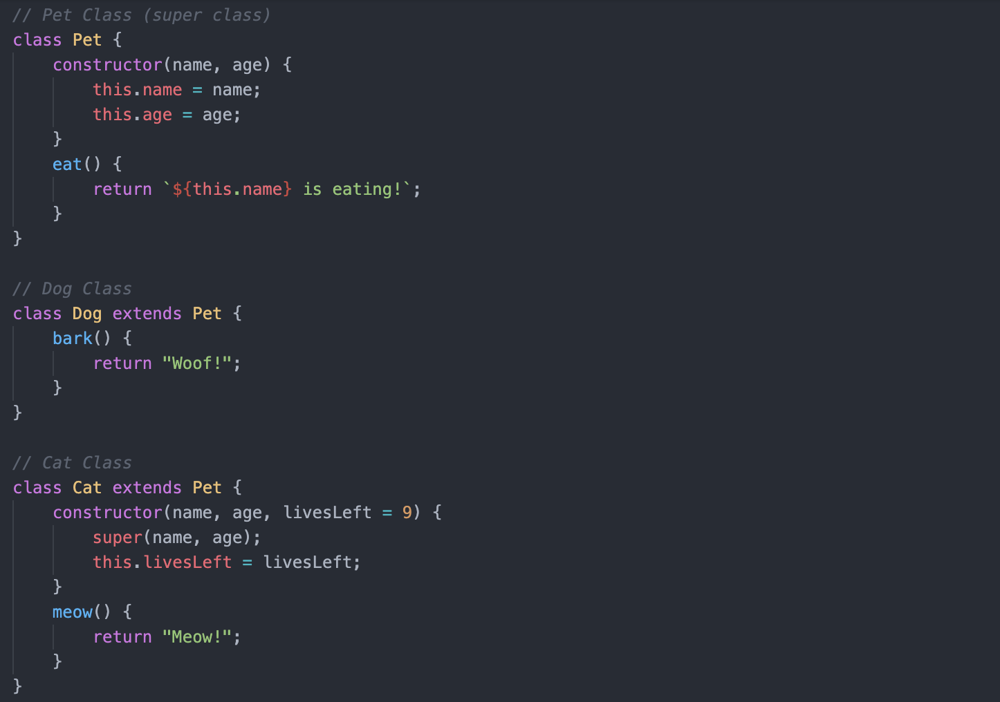
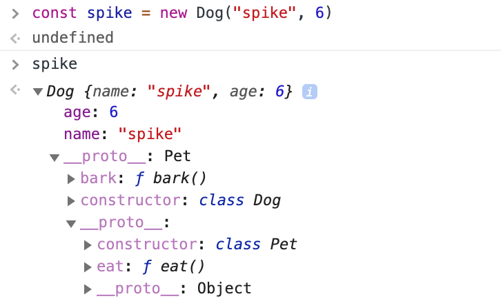
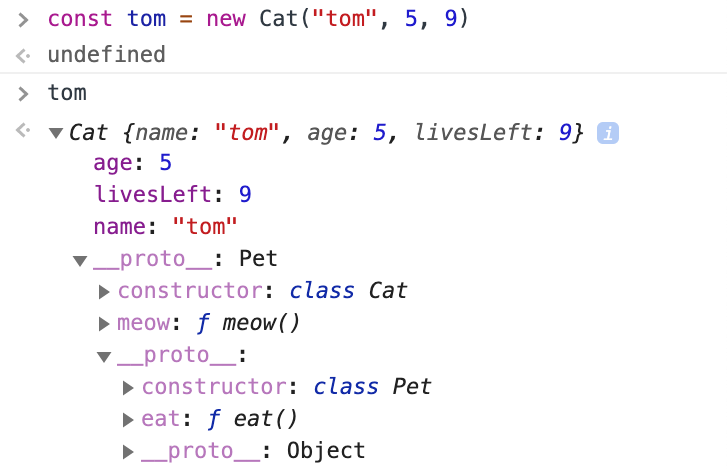

# Prototypes, Classes, and OOP

## Table of Contents
- [Object Oriented Programming (OOP)](#object-oriented-programming-oop)
- [JavaScript and OOP](#javascript-and-oop)
  - [Object Prototypes](#object-prototypes)
- [Ways to Create Objects in JS](#ways-to-create-objects-in-js)
  - [Factory Function](#factory-function)
  - [Constructor Function](#constructor-function)
  - [Class](#class)
    - [Instance Methods vs. Class Methods](#instance-methods-vs-class-methods)
    - [`extends` and `super` Keywords](#extends-and-super-keywords)

## Object Oriented Programming (OOP)
> ...a programming paradigm in computer science that relies on the concept of classes and objects. It is used to structure a software program into simple, reusable pieces of code blueprints (usually called classes), which are used to create individual instances of objects. | Educative

> A class is an abstract blueprint that creates more specific, concrete objects. Classes often represent broad categories, like `Car` or `Dog` that share attributes. These classes define what attributes an instance of this type will have, like color, but not the value of those attributes for a specific object. | Educative

> Classes can also contain functions called **methods** that are available only to objects of that type. These functions are defined within the class and perform some action helpful to that specific object type. | Educative

## JavaScript and OOP
- JS is not a **class-based** language. Rather, it is a **prototype-based** language.
  - Class-based
    - Classes are used to define objects.
    - An object is an instance of a class, and it has its own unique set of values for the defined properties of the class.
  - Prototype-based
    - Prototypes are used to define objects.
    - The **prototype** object is the shared template from which all objects of that prototype inherit attributes, methods, and functionalities.
- **JS is able to support OOP through the use of its prototype system and the constructor method.**
  - The `class` syntax was added to JavaScript since ES2015. However, it is only syntactic sugar for JS' prototype system and the constructor method.
  - The `extends` keyword is essentially based on a prototype-based inheritance.
### Object Prototypes
- Prototypes are the mechanism by which JS objects inherit features from one another.
  - An object/instance has a prototype object from which it inherits properties and methods.
- Objects can have a **prototype** object, which acts as a *template object* that it inherits properties and methods from.
- `prototype` vs. `__proto__`
  - `prototype`
    - The *blueprint object* on a *Function object* that serves as the prototype for objects constructed by that *Function*.
      - It is only accessible on constructor functions (Ex: `Array.prototype`, `Object.prototype`, `String.prototype`, `Number.prototype`).
    - Ex: the `Array.prototype` object contains all attributes and methods for arrays. All instantiated arrays, whichever approach was used to create them, inherit from this prototype object.
      ```js
      const arr1 = [];
      const arr2 = new Array();
      const arr3 = Array.from("");

      arr1.prototype === arr2.prototype; // true
      arr2.prototype === arr3.prototype; // true
      ```
      - More properties and methods can be added to this prototype object (although not recommended), which all instances will inherit.
      ```js
      Array.prototype.sayHello = "Hello";

      const arr = [];
      arr.sayHello; // "Hello";
      ```
  - `__proto__`
    - A property on an instance that references the object's `prototype` object.
      ```js
      const arr = []; // At the point of instantiation, `arr.__proto__` is set to reference `Array.prototype`.

      arr.__proto__; // [constructor: ƒ, at: ƒ, concat: ƒ, copyWithin: ƒ, fill: ƒ, …]
      arr.__proto__ === Array.prototype; // true
      arr.prototype; // undefined

      arr instanceof Array; // true
      arr instanceof Object; // true <-- JS objects are built on `Object.prototype` - the prototype/blueprint of all objects in JS.
      ```

## Ways to Create Objects in JS
### Object Literal
- A singleton approach in that there is only a single instance.
```js
const color = {
  name: "black",
  r: 0,
  g: 0,
  b: 0,
  hex: function() {
    return "#" + ((1 << 24) + (this.r << 16) + (this.g << 8) + this.b).toString(16).slice(1);
  },
  rgb: function() {
    return `rgb(${this.innerRGB()})`;
  },
  rgba: function(a = 1) {
    return `rgba(${this.innerRGB()}, ${a})`;
  },
  innerRGB: function() {
    return `${r}, ${g}, ${b}`;
  }
}
```
### Factory Function
- Create a function that creates a prototype object with properties and methods based off of the passed in arguments.
- This is not ideal as all attributes/methods are newly generated for every intsance instead of in a prototype object.
#### Example


#### Shortcomings
- Along with the unique properties, functions/methods are recreated and a unique copy is added to every object that is henceforth made.
- It is unnecessary and inefficient for each object to have its own copy of the function/method.
- i.e., the methods are not stored in `__proto__`.
### Constructor Function
- Create a constructor function that adds methods to the Object prototype.
- This approach is better than a Factory Function in that instances share the same prototype object.
- Notes
  - Capital first letter indicates a constructor function.
  - There is never a `return` value in constructor functions.
  - `this` keyword is referenced directly in the function; not in an object.
- **`new`** Operator
  1. Creates a plain, blank JS object.
    - Ex: `const color = {};`
  3. Links (sets the constructor of) this object to another object.
  4. Passes the newly created object from Step 1 as the `this` context.
  5. Returns `this` object if the function doesn't return its own object.
    - Ex: `return color;`
#### Example


#### Shortcomings
- Things are not grouped together.
  - The constructor function and methods, are defined separately.
### Class
- ES2015 `class` is just syntactic sugar for doing the same thing as the Constructor Function above (which is based on JS' existing prototype-based inheritance).
  - JavaScript does not really have classes.
  - It does not introduce a new object-oriented inheritance model to JavaScript.
  - Ex: the below are the same.
    ```js
    const Pic = function(x,y,image) {
      this.x = x;
      this.y = y;
      this.image = image;
    }

    let dogPic = new Pic(300,300,"dog.jpg");
    ```
    ```js
    class Pic {
      constructor(x,y,image) {
        this.x = x;
        this.y = y;
        this.image = image;
      }
    }

    let dogPic = new Pic(300,300,"dog.jpg");
    ```
- Notes
  - Capital first letter indicates a class.
  - There is always a `constructor(){}` function, which executes immediately whenever a new class is created. 
  - Add properties and methods in one go.
  - Instances of classes are created with the `new` keyword.
#### Instance Methods vs. Class Methods
##### Instance Methods
- Methods that provide functionality that pertains to an individual instance of a class.
- Example
  ```js
  class Student {
    constructor(firstName, lastName) {
      this.firstName = firstName;
      this.lastName = lastName;
    }

    fullName() {
      return `${this.firstname} ${this.lastName}`;
    }
  }

  let student1 = new Student("Daeram", "Chung");
  student1.fullName(); // "Daeram Chung"
  ```
##### Class Methods
- Using the `static` keyword, define methods or functionalities that is pertinent to classes but not necessarily to individual instances of a class.
- Static methods are called without instantiating their class and cannot be called through a class instance.
- Static methods are often used to create utility functions for an application.
- Example
  ```js
  class Student {
    constructor(firstName, lastName) {
      this.firstName = firstName;
      this.lastName = lastName;
    }
    
    static enrollStudents(...students) {
      // send an email, etc.
    }
  }
  
  let student1 = new Student("Daeram", "Chung");
  let student2 = new Student("Tom", "Jerry");
  
  Student.enrollStudents([student1, student2])
  ```
#### Example



#### `extends` and `super` Keywords
- Sharing functionality between classes, essentially subclassing/inheritance.
- **`extends`** Keyword
  - Allows the use of properties and methods from another (super) class.
  - The `constructor` and methods of the original class have priority to that of the super class.
- **`super()`** Keyword
  - References the super class that we are extending from.
  - It will call the `constructor` from the super class.
  - If the `constructor` needs other additional properties, instead of rewriting what's already written in the super class, do `super([arguments])` and only write the additional properties.
#### Example




## Reference
[What is Object Oriented Programming? OOP Explained in Depth](https://www.educative.io/blog/object-oriented-programming)  
[__proto__ VS. prototype in JavaScript - Stack Overflow](https://stackoverflow.com/questions/9959727/proto-vs-prototype-in-javascript)  
