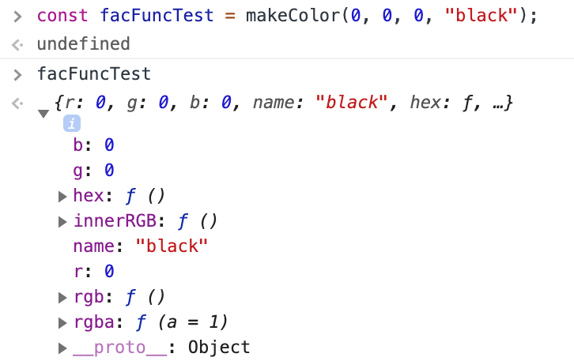

# Prototypes, Classes, and OOP

## Factory Function
- Make a prototype object to which we can add properties and methods based off of arguments that have been provided, and then return that object.
- One way of making objects based off of a pattern/recipe (not ideal).
### Example

### Outcome

### Shortcoming
- Along with the unique properties, functions/methods are recreated and a unique copy is added to every object that is henceforth made.
- It is unnecessary and inefficient for each object to have its own copy of the function/method.
- i.e., the methods are not stored in `__proto__`.

## Constructor Function
- Another way of making objects based off of a pattern/recipe.
- Notes
  - Capitalalize first letter indicates a constructor function.
  - There is never a `return` value in constructor functions.
  - `this` keyword is referenced directly in the function; not in an object.
- **`new`** Operator
  1. Creates a plain, blank JS object.
    - Ex: `const color = {};`
  3. Links (sets the constructor of) this object to another object.
  4. Passes the newly created object from Step 1 as the `this` context.
  5. Returns `this` object if the function doesn't return its own object.
    - Ex: `return color;`
### Example

### Outcome

