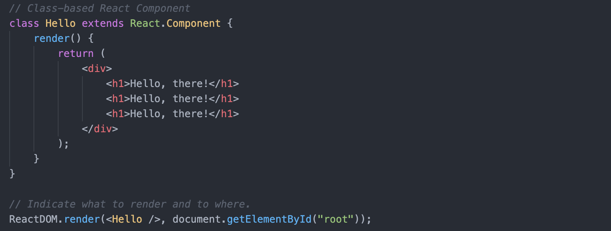
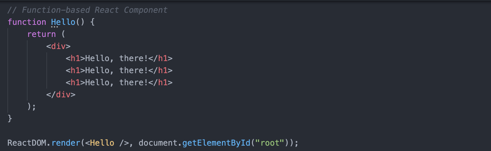
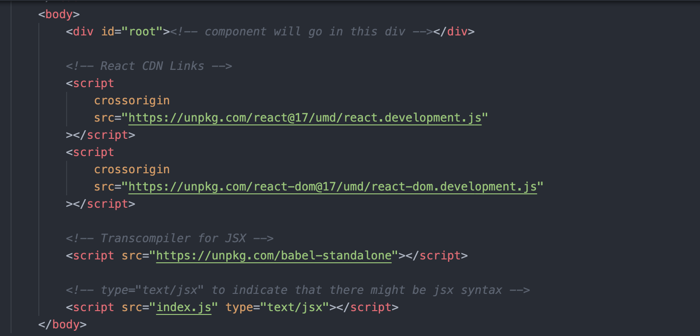
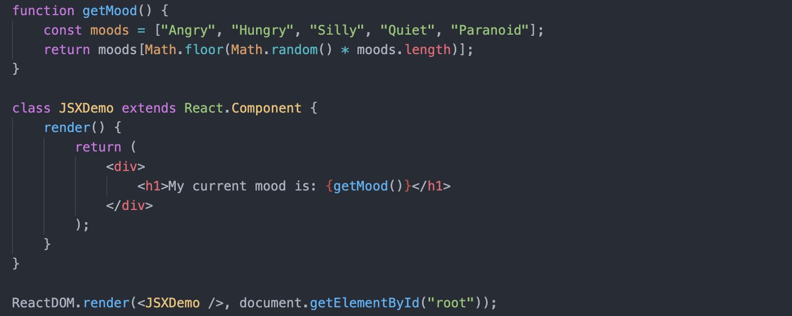
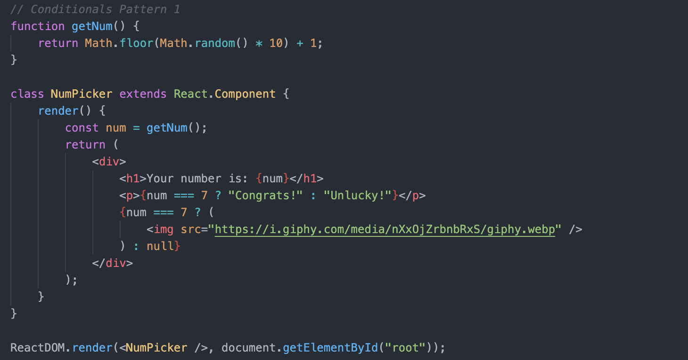
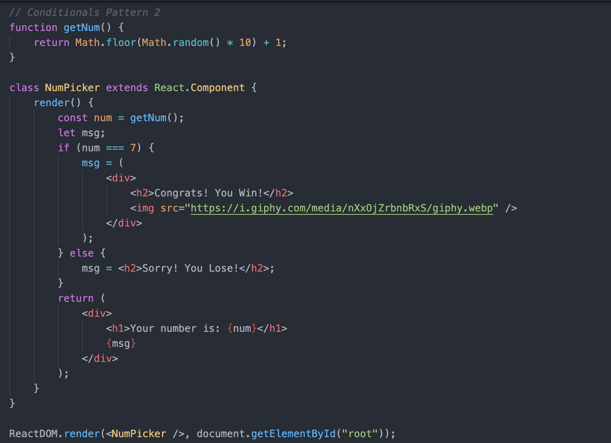

# Intro to React

## Table of Contents
- [What is it?](#what-is-it)
- [Components](#components)
  - [Creating Components](#creating-components)
- [Setup](#setup)
- [Standard React App Layout](#standard-react-app-layout)
- [JSX](#jsx)
  - [Basic JSX Rules](#basic-jsx-rules)
  - [Embedding JS in JSX](#embedding-js-in-jsx)
  - [Conditionals in JSX](#conditionals-in-jsx)

## What is it?
- Front-end framework/library for building user interfaces.
- Helps us make individual components and then combine them to make larger applications.
- Usually combinedwith other tools like React Router, Webpack, Redux, etc.
### Main Goals
- Make it easy to make reusabale "view components".
- These "encapsulate" logic and HTML into a class.
- Often make it easier to build modular applications.

## Components
- The building blocks of React.
  - Components let you split the UI into independent, reusable pieces and think about each piece in isolation.
- Reusable pieces of JS logic, HTML, CSS thata re combined into one modular component that can then be used to build a larger application.
  - Typically combine UI (HTML/CSS) with JS logic, into a single wrapped up component.
- Classes that know how to render themselves into HTML.
### Creating Components
#### Class Components
- The "traditional" React component.
- Write logic in a JS Class.
- Must include a render method that returns something.
  - `render() { return ()}`
  - Can return only one thing (ex: container/wrapper), which can consist of multiple things.
##### Example

#### Function Components
- Historically used for simpler "dumb" components.
- Write logic in a JS function.
- No render method needed, just return content.
##### Example

#### Class vs. Function Components
- Both can accept props and render content.
- Historically, function components couldn't use important features like:
  - State
  - Lifecycle methods
- However, with the introduction of Hooks, we can now write full-featured function components.
### Reference
[Components and Props - React](https://reactjs.org/docs/components-and-props.html)


## Setup
### Server
- Always need to start up a server because babel doesn't work on file protocol.
### index.html Setup


## Standard React App Layout
- **1 component per file, with component name as filename.**
  - Keep individual components in separate js files.
  - Ex: `Hello` component in Hello.js, and not in index.js
- **Create an App component file App.js**
  - Top-level component is called *App*.
  - Combines whatever components that we want into a single element/component that we then render.
  - It's usually the only thing that's being rendered in index.js.
  - Example
    ```
    class App extends React.Components {
      render() {
        return (
          <div>
            <h1>Greetings!</h1>
            <Hello />
            <Goodbye />
          </div>
        )
      }
    }
    ```
- ***Order of script tags in index.html.***
  - Prerequisite components need to be run first.
### Example


## JSX
- JavaScript Syntax Extension / JavaScript + XML
- Tool that allows us to write HTML-looking code directly in JS.
- Allows us to combine our UI with our JS logic directly in the script rather than having a separate template file in HTML taht we then call up on in JS.
- JSX is not legal JavaScript.
  - Therefore, it has to be "transpiled" to JavaScript using a transpiler like Babel.
  - Babel converts the HTML characters into valid JS code.
### Basic JSX Rules
  - Elements must either:
    - have an explicit closing tag: `<b>...</b>`
    - be explicitly self-closed: `<input name="msg"/>`
      - Leaving out `/` will result to syntax error.
### Embedding JS in JSX
- `{}` escapes JSX and allows JS expressions.
#### Example

### Conditionals in JSX
#### Example 1

#### Example 2

### Reference
[Introducing JSX - React](https://reactjs.org/docs/introducing-jsx.html)  
[JSX In Depth - React](https://reactjs.org/docs/jsx-in-depth.html)  
[ConditionalRendering - React](https://reactjs.org/docs/conditional-rendering.html)


