# Properties and More

## Table of Contents
- [Properties](#properties)
- [Looping in JSX](#looping-in-jsx)
- [The 2 Ways of Styling React](#the-2-ways-of-styling-react)

## Properties
- A useful component is a reusable one, which often means making it configurable or customizable.
- Way of passing data from one component to another (from a parent to a child).
### Using Properties
- Go to wherever you're calling upon a component and pass data inside the component tag (just like passing in a `src` attribute for an image).
- `console.log(this.props)` to see props object.
#### Example
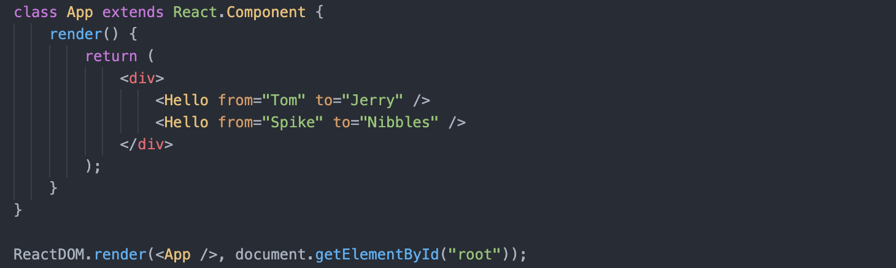
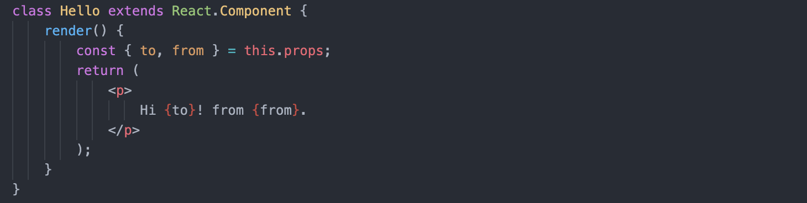
### Properties Requirements
- **Properties are for *configuring* your component.**
- **Properties are *immutable*.**
  - Ex: `this.props.from = "Topsy"` results in an error.
  - *Doesn't mean that the data in your application cannot change or that your components can never be altered.*
  - *But we don't do it through props.*
### Other Types of Properties
- Properties can be strings.
  - Ex: `<User name="Tom" title="Cat"/>`
- For other types, embed JS expression using `{}`.
  - Ex: `<User name="Tom" salary={999999} hobbies={["chasing", "piano", "games"]}/>`
#### Example
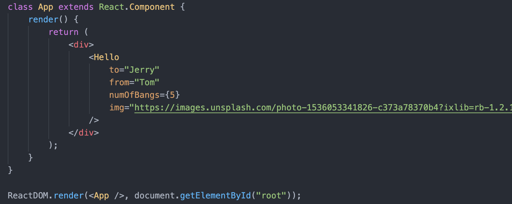
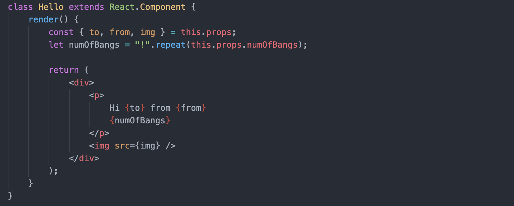
### Default Props
- Components can specify default values for missing props.
- Simply, define an object called **`defaultProps`** with key-value pairs using the **`static`** keyword.
#### Example
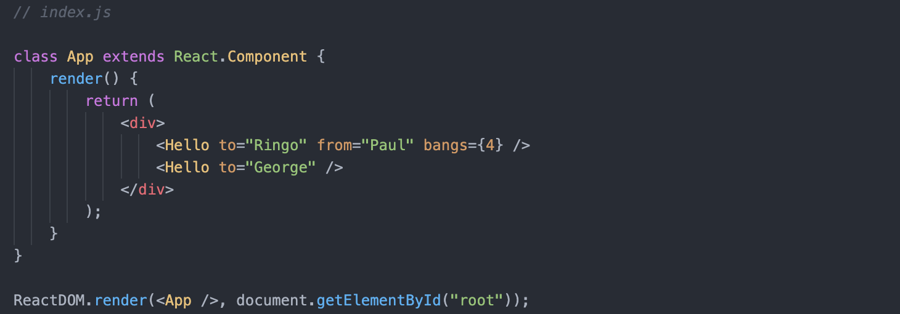
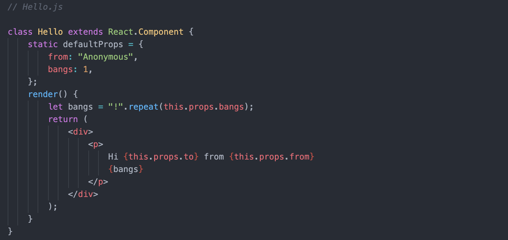

## Looping in JSX
### **`array.map(fn)`**
- Common to use to output loops in JSX.
- Ex: someData.map to create more complex markup or other child components, etc.
### Example
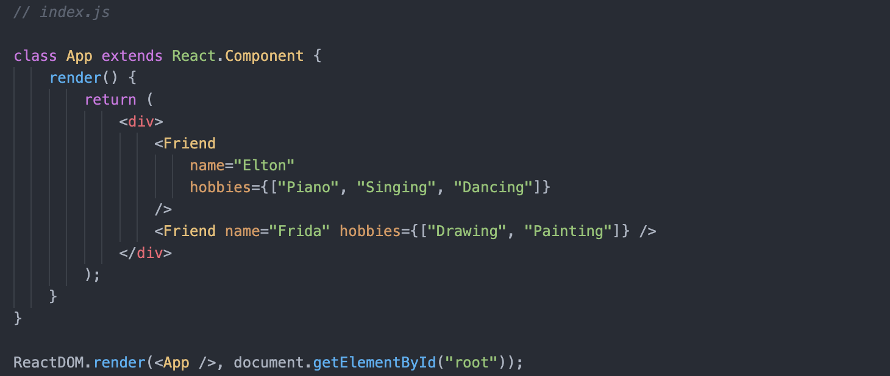
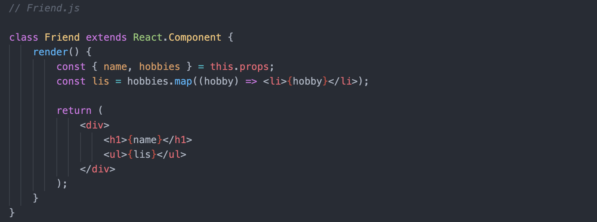

## The 2 Ways of Styling React
1. Define CSS classes that you toggle on and off.
    - JSX uses **`className`** instead of `class`.
2. Can also add inline CSS styles rather than through a CSS class, by passing in a JS object to `style`.
### Example
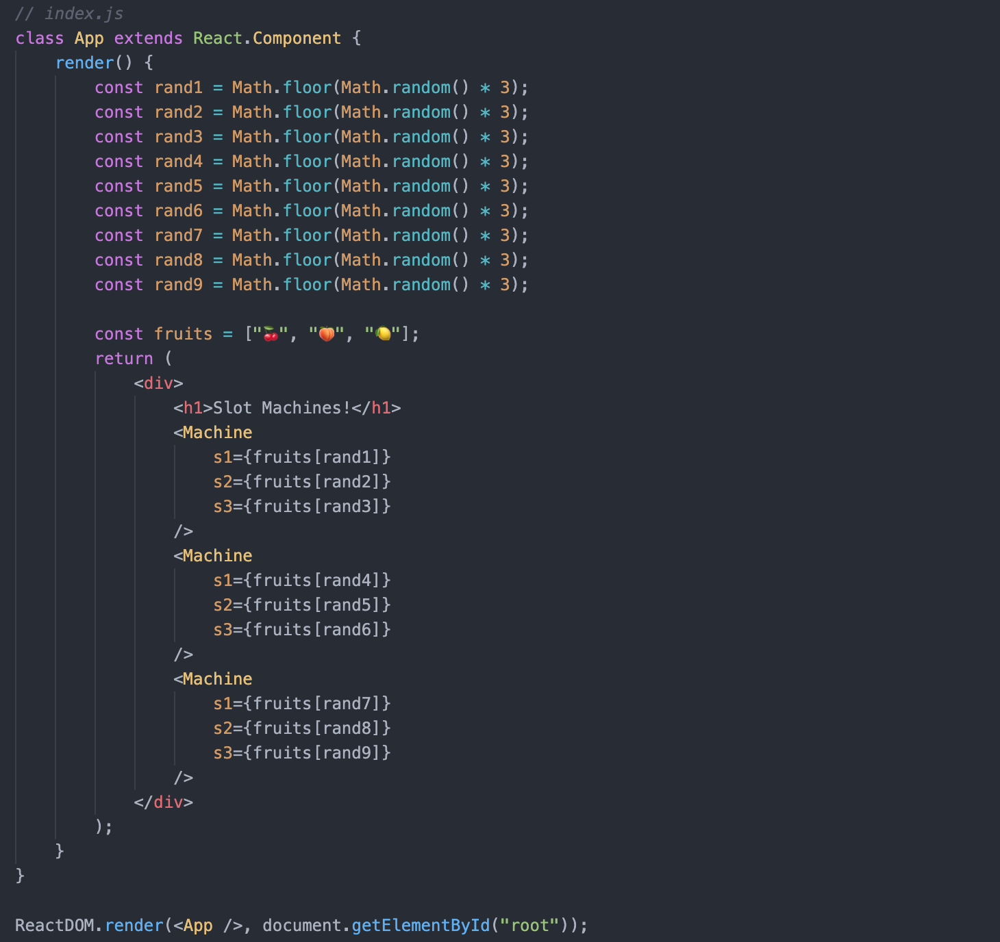
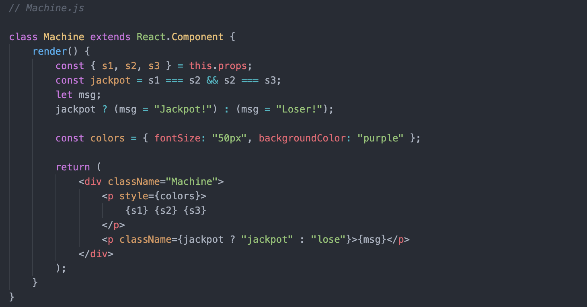
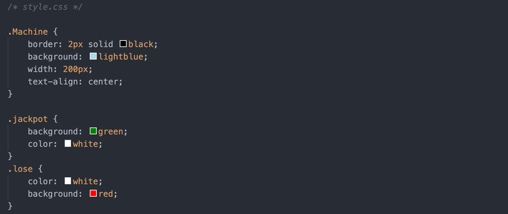
