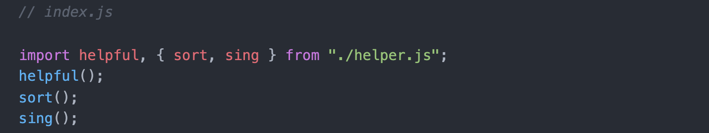
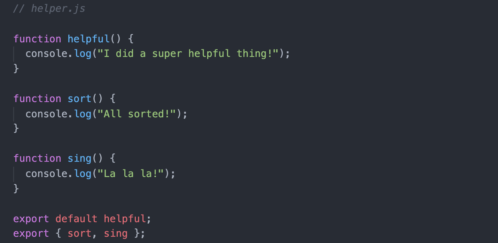

# Create React App
- A utility script that:
  - Creates a a skeleton react project with a files and folders already created.
    - The "src" folder is where all the components we make go in.
  - Sets it so that JS files are run through Babel automatically.
  - Lets us use super-modern JavaScript features/idioms.
  - Makes testing and deployment much easier.
- *Use this instead of using CDN Links.*

## Table of Contents
- [Installing Create React App](#installing-create-react-app)
- [Terminal Commands in New Directory](#terminal-commands-in-new-directory)
- [Webpack](#webpack)
- [Modules](#modules)
- [CRA and Components](#cra-and-components)

## Installing Create React App
### Installation Method 1 - using NPX
- Only works with npm 5.2 or higher.
- No need to install `create-react-app` first.
- Create a new `create-react-app` instance with the specified name.
```
npx create-react-app name-of-your-app
cd name-of-your-app
npm start
```
### Installation Method - using NPM
- Install globally just once.
- Henceforth, do **`create-react-app name-of-your-app`** to create each React project that you want.
```
npm install -gcreate-react-app
create-react-app name-of-your-app
cd name-of-your-app
npm start
```

## Terminal Commands in New Directory
- **`npm start`**
  - Starts the development server for your app.
  - Execute inside of the application directory.
  - Automatically open up in browser.
- **ctrl + c**
  - Stop the server running.
- **`npm run build`**
  - Bundles the app into static files for production.
- **`npm test`**
  - Starts the test runner.
- **`npm run eject`**
  - Removes this tool and copies build dependencies, configuration files and scripts into the app directory. If you do this, you can't go back!

## Webpack
- CRA is built on top of "Webpack", which is a JS utility that:
  - Enables us to import/export modules.
    - Makes it easier for us to reference files and assets in other files.
    - Packages up all CSS, images, JS into a single file for browser.
    - Dramatically reduces the number of HTTP requests that we have to make.
  - Hot reloading
    - When you change a source file, the browser automatically reloads.
    - Only tries to reload the relevant files.
  - Enables easy testing and deployment.

## Modules
- CRA uses ES2015 "modules".
- A newer, standardized version of Node's `require()`.
- ***Use this to export/import classes, data, functions between JS files.***
### Notes
#### Exporting
  - `default`
    - When the entire file is required, the default thing that should be exported.
  - Use `{}` when not exporting by default.
#### Importing
  - `./` prefix means look in the folder of the current file.
  - If no `./` prefix, it will look in the modules folder.
  - Can be imported with any name for the "container" for whatever has been exported.
  - *When exported not by default, the names need to match.*
#### To Default or Not?
- Conventionally, default exports are used when there's a "most likely" thing to export out of the file.
  - Ex: `import React from "react";`
- Not necessary to to make a default export but it can be helpful to indicate the most important thing in a file.
### Example



## CRA and Components


