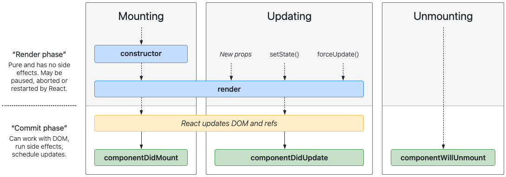

# Component Lifecycle Methods

## Table of Contents
- [What are Component Lifecycle Methods?](#what-are-component-lifecycle-methods)
  - [3 Main Phases](#3-main-phases)
    - [1) Mounting](#1-mounting)
    - [2) Updating](#2-updating)
    - [3) Unmounting](#3-unmounting)
- [Reference](#reference)

## What are Component Lifecycle Methods?
- Every component comes with methods that allow developers to update application state and reflect the changes to the UI before/after key react "events" (events/stages in the lifecycle of a component).
### 3 Main Phases
- For every component, when we render it (ex: to App.js), there are 3 stages.
- When rendering a component, the very first thing it does is to run the constructor.
  - The constructor is used to initialize state and to bind event handlers.
- After the constructor, React calls `render()`. React updates the DOM to match the output of `render()`.
- After `render()` has been called, we have access to `componentDidMount()`.
<hr />
- Things that could trigger a change(re-render) are: `setState()`, new props (ex: passed in from a parent component with new values), `forceUpdate()` (useful for when data is not part of the state, or is not a prop, and it's changing. some external data that we want to manually force a re-render).
- After a re-render, we have access to `componentDidUpdate()`.
<hr />
- We have access to `componentWillUnmount()` right before a component is unmounted/destroyed/removed from the page.



#### 1) Mounting
- **`componentDidMount()`** is a lifecycle method that we can define, which React will automatically run it for us **once** after the component has mounted (after the first render to the DOM) and will not run for subsequent re-renders.
- **"Mounting"** refers to the first time the component is rendered to the DOM.
- It is a good place to load any data via AJAX or set up subscriptions/timers.
- *Note: calling `setState()` here will trigger re-render.*
  - By the time we get to `componentDidMount()`, render has already been called once. So setting the state in `componentDidMount()` will re-render.
##### Example 1 - Flow
- Starting a timer when Clock instance is first rendered to the DOM.
```js
class Timer extends Component {
  constructor(props) {
    super(props);
    this.state = {
      time: new Date(),
    }
    console.log("In Constructor");
  }

  componentDidMount() {
    console.log("In ComponentDidMount");
    this.timerID = setInterval(() => {
      this.setState({ time: new Date() })
    }, 1000);
  }

  render() {
    console.log("In Render");
    return <h1>{this.state.time.getSeconds()}</h1>
  }
}
```
```js
// In Constructor
// In Render
// In ComponentDidMount
// In Render <-- on repeat
```
##### Example 2 - AJAX and loader
- **Anytime we're fetching data, it is conventional to fetch it in `componentDidMount()`, and not the constructor.**
```js
// ZenQuote.js

import React, { Component } from "react";
import axios from "axios";
import "./ZenQuote.css"

class ZenQuote extends Component {
  constructor(props) {
    super(props);
    this.state = { 
      quote: "",
      isLoaded: false,
    }
  }
 
  componentDidMount() {
    // Load Data
    axios.get("https://api.github.com/zen")
      .then(res => {
        setTimeout(
          function () {
            // Set State with that Data
            this.setState({ 
              quote: res.data,
              isLoaded: true
            });
          }.bind(this), 3000
        );
      });
  }

  render() {
    return (
      <div>
        {this.state.isLoaded ? (
         <div>
            <h1>Always remember...</h1>
            <p>{this.state.quote}</p>
         </div>
        ) : (
          <div className="loader"></div>
        )}
      </div>
    );
  }
}

export default ZenQuote;
```
##### Example 3 - async functions
```js
// App.js
import React, { Component } from "react:
import GithubUserInfo from "./GithubUserInfo.js"

class App extends Component {
  render() {
    return (
      <div classname="App">
        <GithubUserInfo username="facebook" />
        <GithubUserInfo username="Kakamotobi" />
      </div>
    );
  }
}
```
```js
//GithubUserInfo.js
import React, { Component } from "react:
import axios from "axios";

class GithubUserInfo extends Component {
  constructor(props) {
    super(props);
    this.state = {
      user: {}
    }
  }
  
  async componentDidMount() {
    const url = `https://api.github.com/users/${this.props.username}`
    const res = await axios.get(url);
    const data = res.data;
    this.setState({
      user: data
    });
  }
  
  render() {
    const {name, bio, avatar_url} = this.state.user;
    
    return (
      <div>
        <h1>{name}</h1>
        <p>{bio}</p>
        
      </div>
    )
  }
}

export default GithubUserInfo;
```

#### 2) Updating
- **`componentDidUpdate()`** is a lifecycle method that runs **everytime** after a component is updated (re-render) due to passing in new props, `setState()` or `forceUpdate()`.
- This is a suitable place to implement any side effect operations.
  - Send the data off after it has been updated.
  - Ex: syncing up with localStorage or any other database.
  - Ex: auto-saving.
  - Ex: updating the DOM for uncontrolled components.
- We can do a comparison between the previous and current props and state.
  - Syntax: `componentDidUpdate(prevProps, prevState) { // setState can be called here if needed }`
##### Example 1 - Flow
```js
// ZenQuote.js

import React, { Component } from "react";
import axios from "axios";
import "./ZenQuote.css"

class ZenQuote extends Component {
  constructor(props) {
    console.log("Inside constructor");
    super(props);
    this.state = { 
      quote: "",
      isLoaded: false,
    }
  }
  
  componentDidMount() {
    console.log("Inside componentDidMount");
    // Load Data
    axios.get("https://api.github.com/zen")
      .then(res => {
        setTimeout(
          function () {
            // Set State with that Data
            this.setState({ 
              quote: res.data,
              isLoaded: true
            });
          }.bind(this), 3000
        );
      });
  }
  
  componentDidUpdate(prevProps, prevState) {
    console.log("Inside componentDidUpdate");
    console.log(prevState.quote);
    console.log(this.state.quote);
  }

  render() {
    console.log("Inside render");
    return (
      <div>
        {this.state.isLoaded ? (
         <div>
            <h1>Always remember...</h1>
            <p>{this.state.quote}</p>
         </div>
        ) : (
          <div className="loader"></div>
        )}
      </div>
    );
  }
}

export default ZenQuote;
```
```js
// Inside constructor
// Inside render
// Inside componentDidMount
// Inside render <-- re-render due to change
// Inside compomnentDidUpdate
// Previous state
// New state
```
##### Example 2 - Changing State and Passing in New Props
```js
// TodoList.js

import React, { Component } from "react";
import { v4 as uuid } from "uuid";
import NewTodoForm from "./NewTodoForm.js";
import Todo from "./Todo.js";

class TodoList extends Component {
  constructor(props) {
    super(props);
    this.state = {
      todos: [],
    };

    this.addTodo = this.addTodo.bind(this);
    this.editTodo = this.editTodo.bind(this);
    this.removeTodo = this.removeTodo.bind(this);
    this.toggleCompletion = this.toggleCompletion.bind(this);
  }

  addTodo(newTodo) {
    const newTodoObj = { ...newTodo, id: uuid() };
    this.setState({
      todos: [...this.state.todos, newTodoObj],
    });
  }

  editTodo(id, edittedTask) {
    const updatedTodos = this.state.todos.map((t) => {
      if (t.id === id) {
        return { ...t, task: edittedTask };
      } else {
        return t;
      }
    });
    this.setState({
      todos: updatedTodos,
    });
  }

  removeTodo(id) {
    this.setState({
      todos: this.state.todos.filter((t) => t.id !== id),
    });
  }

  toggleCompletion(id) {
    const updatedTodos = this.state.todos.map((t) => {
      if (t.id === id) {
        return { ...t, completed: !t.completed };
      } else {
        return t;
      }
    });
    this.setState({
      todos: updatedTodos,
    });
  }

  componentDidUpdate(prevProps, prevState) {
    console.log("In TodoList componentDidUpdate");
    console.log(prevState.todos);
    console.log(this.state.todos);
  }

  render() {
    const todos = this.state.todos.map((t) => (
      <Todo
        key={t.id}
        id={t.id}
        task={t.task}
        completed={t.completed}
        editTodo={this.editTodo}
        removeTodo={this.removeTodo}
        toggleCompletion={this.toggleCompletion}
      />
    ));

    return (
      <div className="TodoList">
        <NewTodoForm addTodo={this.addTodo} />
        <ul className="TodoList__todos-container">{todos}</ul>
      </div>
    );
  }
}

export default TodoList;
```
- **Important!**
  - The edit toggle uses the state "isEditting" to hide or show the form. So it triggers `componentDidUpdate()` in Todo.js.
  - `componentDidUpdate()` also runs over and over upon the typing in the input because of the onChange event handler that sets the state "edittedTask" anytime an input changes (controlled component).
```js
// Todo.js

import React, { Component } from "react";
import "./Todo.css";

class Todo extends Component {
  constructor(props) {
    super(props);
    this.state = {
      isEditting: false,
      edittedTask: this.props.task,
    };

    this.toggleEditting = this.toggleEditting.bind(this);
    this.handleChange = this.handleChange.bind(this);
    this.handleEditTodo = this.handleEditTodo.bind(this);
    this.handleRemoveTodo = this.handleRemoveTodo.bind(this);
    this.handleToggleCompletion = this.handleToggleCompletion.bind(this);
  }

  toggleEditting() {
    this.setState({
      isEditting: !this.state.isEditting,
    });
  }

  handleChange(evt) {
    this.setState({
      [evt.target.name]: evt.target.value,
    });
  }

  handleEditTodo(evt) {
    evt.preventDefault();

    console.dir(evt.target);

    this.props.editTodo(this.props.id, this.state.edittedTask);
    this.setState({
      isEditting: false,
    });
  }

  handleRemoveTodo() {
    this.props.removeTodo(this.props.id);
  }

  handleToggleCompletion(evt) {
    this.props.toggleCompletion(this.props.id);
  }

  componentDidUpdate(prevProps, prevState) {
    console.log("In Todo componentDidUpdate");
    console.log(prevProps.task);
    console.log(this.props.task);
  }

  render() {
    let displayResult;

    if (this.state.isEditting) {
      displayResult = (
        <div className="Todo">
          <form className="Todo__edit-form" onSubmit={this.handleEditTodo}>
            <input
              className="Todo__edit-input"
              name="edittedTask"
              value={this.state.edittedTask}
              onChange={this.handleChange}
            />
            <button className="Todo__save-btn">Save</button>
          </form>
        </div>
      );
    } else {
      displayResult = (
        <li className={this.props.completed ? "Todo completed" : "Todo"}>
          <div className="Todo__task" onClick={this.handleToggleCompletion}>
            {this.props.task}
          </div>
          <button
            className="Todo__editBtn"
            type="button"
            onClick={this.toggleEditting}
          >
            Edit
          </button>
          <button
            className="Todo__removeBtn"
            type="button"
            onClick={this.handleRemoveTodo}
          >
            X
          </button>
        </li>
      );
    }

    return displayResult;
  }
}

export default Todo;
```
#### 3) Unmounting
- **`componentWillUnmount()`** is a lifecycle method that runs right before a component is unmounted/destroyed/removed from the page.
- We can perform any necessary cleanup in this method.
  - Ex: invalidating timers.
  - Ex: cancelling network requests.
  - Ex: handling web sockets, shutting down any open sockets.
  - Ex: cleaning up any subscriptions that were created in `componentDidMount()`.
  - Ex: removing event handlers directly put on DOM.
- `setState()` in `componentWillUnmount()` is useless because the component will never be re-rendered.
  - Once a component instance is unmounted, it will never be mounted again.
##### Example 1 - use case
- Clear the timer when the <Clock /> component is removed(unmounted).
  - We don't want to keep the timer running.
```js
// Clock.js

class Clock extends Component {
  componentDidMount() {
    this.timerID = setInterval(() => {
      this.tick()
    }, 1000);
  }
  
  componentWillUnmount() {
    clearInterval(this.timerID);
  }
}
```
##### Example 2
- Removing a todo from the list will invoke `componentWillUnmount()` as it is removing that instance of the component `<Todo />`.

```js
// Todo.js

import React, { Component } from "react";
import "./Todo.css";

class Todo extends Component {
  constructor(props) {
    super(props);
    this.state = {
      isEditting: false,
      edittedTask: this.props.task,
    };

    this.toggleEditting = this.toggleEditting.bind(this);
    this.handleChange = this.handleChange.bind(this);
    this.handleEditTodo = this.handleEditTodo.bind(this);
    this.handleRemoveTodo = this.handleRemoveTodo.bind(this);
    this.handleToggleCompletion = this.handleToggleCompletion.bind(this);
  }

  toggleEditting() {
    this.setState({
      isEditting: !this.state.isEditting,
    });
  }

  handleChange(evt) {
    this.setState({
      [evt.target.name]: evt.target.value,
    });
  }

  handleEditTodo(evt) {
    evt.preventDefault();

    console.dir(evt.target);

    this.props.editTodo(this.props.id, this.state.edittedTask);
    this.setState({
      isEditting: false,
    });
  }

  handleRemoveTodo() {
    this.props.removeTodo(this.props.id);
  }

  handleToggleCompletion(evt) {
    this.props.toggleCompletion(this.props.id);
  }

  // componentDidUpdate(prevProps, prevState) {
    // console.log("In Todo componentDidUpdate");
    // console.log(prevProps.task);
    // console.log(this.props.task);
  // }

  componentWillUnmount() {
    console.log("In componentWillUnmount");
  }

  render() {
    let displayResult;

    if (this.state.isEditting) {
      displayResult = (
        <div className="Todo">
          <form className="Todo__edit-form" onSubmit={this.handleEditTodo}>
            <input
              className="Todo__edit-input"
              name="edittedTask"
              value={this.state.edittedTask}
              onChange={this.handleChange}
            />
            <button className="Todo__save-btn">Save</button>
          </form>
        </div>
      );
    } else {
      displayResult = (
        <li className={this.props.completed ? "Todo completed" : "Todo"}>
          <div className="Todo__task" onClick={this.handleToggleCompletion}>
            {this.props.task}
          </div>
          <button
            className="Todo__editBtn"
            type="button"
            onClick={this.toggleEditting}
          >
            Edit
          </button>
          <button
            className="Todo__removeBtn"
            type="button"
            onClick={this.handleRemoveTodo}
          >
            X
          </button>
        </li>
      );
    }

    return displayResult;
  }
}

export default Todo;
```

## Reference
[React Lifecycle Methods Diagram](https://projects.wojtekmaj.pl/react-lifecycle-methods-diagram/)
